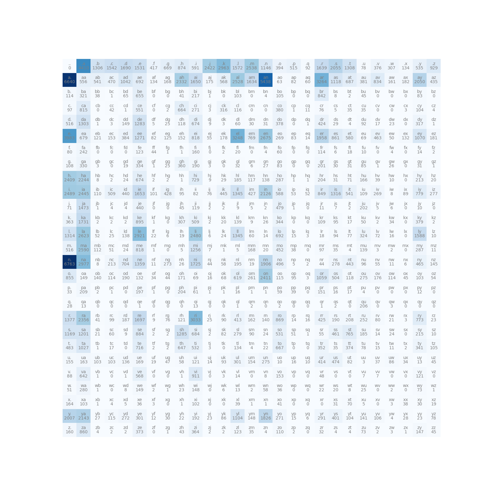
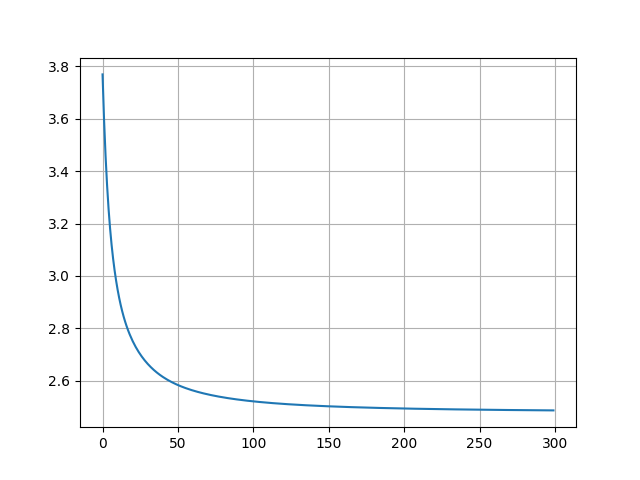

# Bigram Model Implementations

This repository contains two implementations of a bigram language model, designed to predict the next character based on the previous one. Each approach demonstrates a unique methodology for bigram modeling in machine learning:

## Bigram implementation without neural networks

This implementation calculates character-pair frequencies and uses these to determine the probability of each character following a given one. By using these probabilities, the model can make predictions for the next character based on observed frequencies. This approach provides an accessible introduction to bigram models by focusing on probability calculation without complex optimizations.

## Bigram implementation with neural networks

In this more advanced implementation, a neural network is used to capture bigram relationships. The model calculates the negative log likelihood during training, which represents how poorly the model’s predictions match the expected probabilities. Through optimization, the model reduces this loss, improving its accuracy in character prediction. This implementation introduces key neural network techniques like loss calculation and gradient descent optimization.

## Usage

- Install the required packages using `poetry install` or `pip install -r requirements.txt`
- Run jupyter notebook using `jupyter notebook`
- Open the notebook and run the cells

## Frequency plot of bigram

## Loss graph

